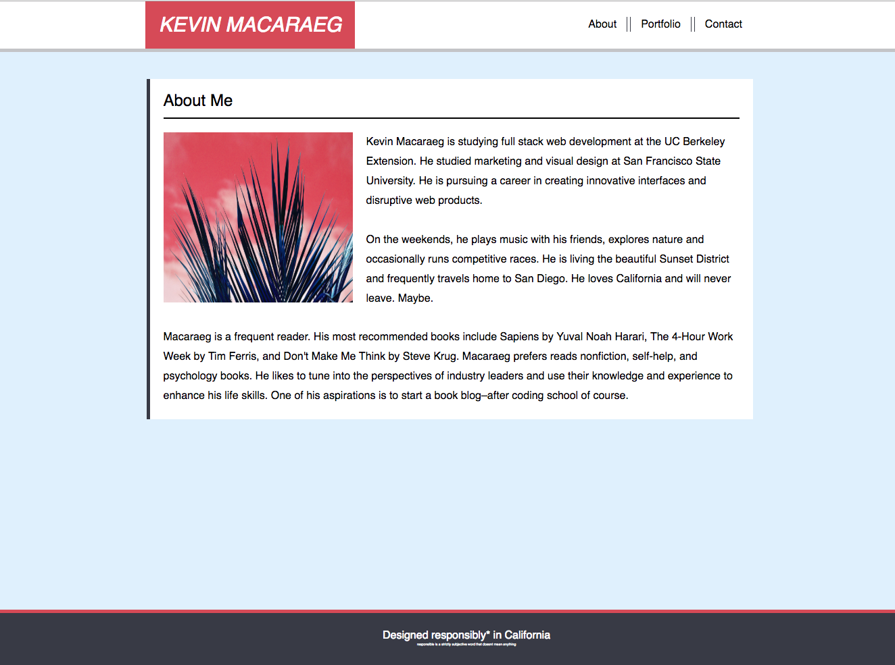

# Portfolio
Kevin Macaraeg is an early product designer in San Francisco, CA. His website was made to showcase his projects from his time at the Web Development Fully Immersive Bootcamp at UC Berkeley Extension.
# Deployed Site
[everysf](https://everysf.github.io/basic-portolio/)
# At a Glance

# Technologies
- HTML
- CSS
# Learning Points
Objective: Learn HTML5. Use CSS to style the page
# Author
[Kevin Macaraeg](https://everysf.github.io/basic-portolio/)
# License